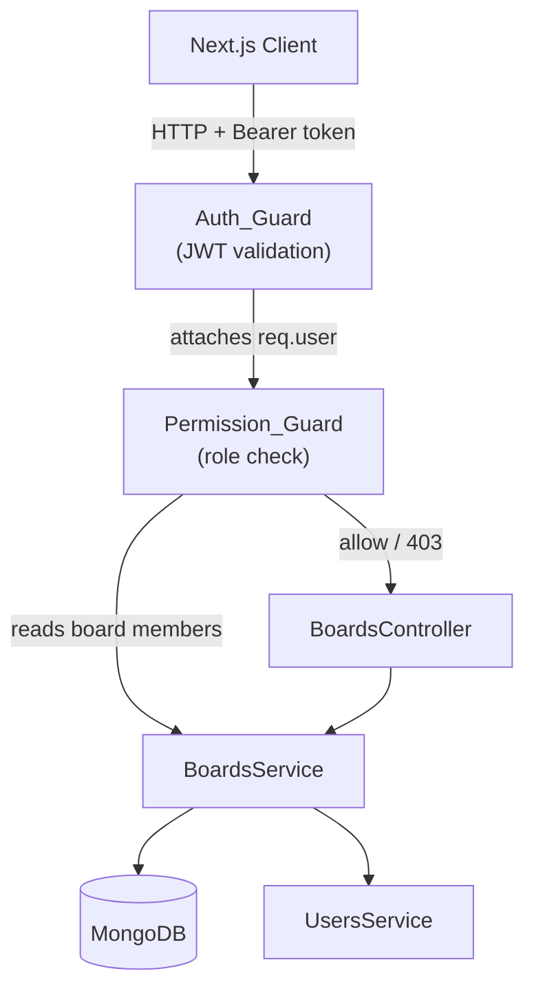

# Design Document: Board Sharing

## Overview

Board Sharing adds multi-user collaboration to a Trello-like application. A board is owned by exactly one user at creation time; that owner can invite other users and assign them one of three roles — `owner`, `editor`, or `viewer`. Every API request is authenticated via JWT (`Auth_Guard`) and then authorized against the caller's board role (`Permission_Guard`) before the handler runs.

The feature is implemented as a NestJS module (`BoardsModule`) backed by MongoDB. The frontend (Next.js) consumes the eight REST endpoints defined in the requirements.

### Key Design Decisions

- Roles are stored as an embedded `members` array inside each Board document (denormalized) to allow a single document read to resolve both board data and membership in one query.
- `Permission_Guard` is a NestJS `CanActivate` guard applied at the controller level; it reads the board's `members` array and compares the caller's `userId` (from the JWT payload) against the required role(s) declared via a `@Roles()` decorator.
- Sole-owner protection is enforced in the service layer, not the guard, because it requires business-logic context (counting owners).
- Cascading delete is handled in the service by issuing `deleteMany` on lists and cards filtered by `boardId` before deleting the board document.

---

## Architecture



Request flow:
1. `Auth_Guard` validates the JWT and attaches `{ userId, email }` to `req.user`.
2. `Permission_Guard` loads the board's `members` array, finds the caller's entry, and compares the role against the `@Roles()` metadata. Returns `403` if the caller is not a member or lacks the required role.
3. The controller delegates to `BoardsService` for all business logic.
4. `BoardsService` calls `UsersService.findByEmail()` during member invitation to resolve email → userId.

---

## Components and Interfaces

### NestJS Module: `BoardsModule`

```
src/boards/
  boards.module.ts
  boards.controller.ts
  boards.service.ts
  dto/
    create-board.dto.ts
    invite-member.dto.ts
    update-member-role.dto.ts
  guards/
    permission.guard.ts
  decorators/
    roles.decorator.ts
  schemas/
    board.schema.ts
```

### Controller: `BoardsController`

| Method | Route | Guards | Roles decorator |
|--------|-------|--------|-----------------|
| POST | `/boards` | Auth_Guard | — |
| GET | `/boards` | Auth_Guard | — |
| GET | `/boards/:boardId` | Auth_Guard, Permission_Guard | `member` (any) |
| DELETE | `/boards/:boardId` | Auth_Guard, Permission_Guard | `owner` |
| GET | `/boards/:boardId/members` | Auth_Guard, Permission_Guard | `member` (any) |
| POST | `/boards/:boardId/members` | Auth_Guard, Permission_Guard | `owner` |
| PATCH | `/boards/:boardId/members/:userId` | Auth_Guard, Permission_Guard | `owner` |
| DELETE | `/boards/:boardId/members/:userId` | Auth_Guard, Permission_Guard | `owner` or `self` |

### Guard: `Permission_Guard`

```typescript
interface PermissionGuardMeta {
  roles: Role[];      // required roles, empty = any member
  allowSelf: boolean; // true for DELETE /members/:userId
}
```

Logic:
1. Extract `boardId` from `req.params`.
2. Load board (lean query, members only).
3. Find caller's membership entry.
4. If not found → `403`.
5. If `allowSelf` and `req.params.userId === req.user.userId` → allow.
6. If caller's role is in `roles` → allow.
7. Otherwise → `403`.

### Service: `BoardsService`

Key methods:

```typescript
createBoard(userId: string, dto: CreateBoardDto): Promise<BoardDocument>
listBoards(userId: string): Promise<BoardSummary[]>
getBoard(boardId: string, userId: string): Promise<BoardDocument>
deleteBoard(boardId: string): Promise<void>
listMembers(boardId: string): Promise<MemberEntry[]>
inviteMember(boardId: string, dto: InviteMemberDto): Promise<MemberEntry>
updateMemberRole(boardId: string, targetUserId: string, dto: UpdateMemberRoleDto, callerId: string): Promise<MemberEntry>
removeMember(boardId: string, targetUserId: string, callerId: string): Promise<void>
```

### DTOs

```typescript
// CreateBoardDto
{ name: string }

// InviteMemberDto
{ email: string; role: Role }

// UpdateMemberRoleDto
{ role: Role; newOwnerId?: string }  // newOwnerId required when owner demotes themselves
```

---

## Data Models

### MongoDB Schema: `Board`

```typescript
@Schema({ timestamps: true })
export class Board {
  @Prop({ required: true })
  name: string;

  @Prop({ type: [MemberEntrySchema], default: [] })
  members: MemberEntry[];
}

@Schema({ _id: false })
export class MemberEntry {
  @Prop({ type: Types.ObjectId, ref: 'User', required: true })
  userId: Types.ObjectId;

  @Prop({ enum: ['owner', 'editor', 'viewer'], required: true })
  role: Role;
}
```

Indexes:
- `{ 'members.userId': 1 }` — fast lookup for `listBoards` and permission checks.
- `{ 'members.userId': 1, 'members.role': 1 }` — fast owner count queries.

### Role Enum

```typescript
export enum Role {
  Owner  = 'owner',
  Editor = 'editor',
  Viewer = 'viewer',
}
```

### API Response Shapes

```typescript
// Board summary (GET /boards)
interface BoardSummary {
  id: string;
  name: string;
  role: Role;
}

// Board detail (GET /boards/:boardId)
interface BoardDetail {
  id: string;
  name: string;
  members: { userId: string; role: Role }[];
}

// Member entry (GET /boards/:boardId/members)
interface MemberResponse {
  userId: string;
  role: Role;
}
```


---

## Correctness Properties

*A property is a characteristic or behavior that should hold true across all valid executions of a system — essentially, a formal statement about what the system should do. Properties serve as the bridge between human-readable specifications and machine-verifiable correctness guarantees.*

### Property 1: Valid Role Constraint

*For any* string value submitted as a role in an invitation or role-update request, the system should accept it if and only if it is one of `owner`, `editor`, or `viewer`; any other value should be rejected with `400 Bad Request`.

**Validates: Requirements 1.1, 1.4**

---

### Property 2: Board Creation Assigns Owner

*For any* authenticated user who creates a board, the resulting board's `members` array should contain exactly one entry — for that user — with `role = owner`.

**Validates: Requirements 1.2**

---

### Property 3: Sole-Owner Invariant

*For any* board and *for any* sequence of mutating operations (create, invite, update role, remove member), the board's `members` array should always contain exactly one entry with `role = owner`. Any operation that would leave the board with zero owners should be rejected with `400 Bad Request`.

**Validates: Requirements 1.5, 3.2, 3.3, 4.2**

---

### Property 4: Member Invitation Grows Membership

*For any* board with `n` members, when an owner successfully invites a new (non-existing) user with a valid role, the board should have `n + 1` members and the new member's role should equal the role specified in the request.

**Validates: Requirements 2.1, 1.3**

---

### Property 5: Duplicate Invite Rejected

*For any* board and *for any* user who is already a member of that board, attempting to invite them again should return `409 Conflict` and leave the member list unchanged.

**Validates: Requirements 2.3**

---

### Property 6: Non-Member Access Denied

*For any* board-scoped endpoint and *for any* user who is not in the board's `members` array, every request should return `403 Forbidden`.

**Validates: Requirements 5.4, 6.4**

---

### Property 7: Non-Owner Management Denied

*For any* board and *for any* member whose role is `editor` or `viewer`, requests to owner-only endpoints (`POST /members`, `PATCH /members/:userId`, `DELETE /boards/:boardId`, `DELETE /members/:userId` for others) should return `403 Forbidden`.

**Validates: Requirements 2.4, 3.4, 4.3, 7.2**

---

### Property 8: Role Permission Matrix

*For any* board and *for any* member, the set of HTTP operations the `Permission_Guard` allows should match exactly the role's permitted operations as defined in the permission matrix:
- `viewer`: only `GET` on board, list, and card endpoints.
- `editor`: `GET/POST/PATCH/DELETE` on list and card endpoints; `GET` only on the board endpoint.
- `owner`: all operations on all board-scoped endpoints.

**Validates: Requirements 5.1, 5.2, 5.3**

---

### Property 9: Self-Leave Allowed

*For any* board and *for any* member whose role is `editor` or `viewer` (i.e., not the sole owner), sending `DELETE /boards/:boardId/members/:userId` where `:userId` matches their own identity should succeed and remove them from the `members` array.

**Validates: Requirements 4.4**

---

### Property 10: Cascading Delete

*For any* board that has associated lists and cards, after a successful `DELETE /boards/:boardId` by the owner, no documents with that `boardId` should remain in the boards, lists, or cards collections.

**Validates: Requirements 7.1**

---

### Property 11: Board List Membership Filter

*For any* authenticated user, the response to `GET /boards` should contain exactly the boards where that user appears in the `members` array — no boards they are not a member of, and no missing boards they are a member of.

**Validates: Requirements 6.1**

---

### Property 12: Response Shape Completeness

*For any* board summary returned by `GET /boards`, the object should contain `id`, `name`, and `role` fields. *For any* board detail returned by `GET /boards/:boardId`, the object should contain `id`, `name`, and a `members` array where each entry has `userId` and `role`.

**Validates: Requirements 6.2, 6.3**

---

### Property 13: Unauthenticated Requests Rejected

*For any* endpoint and *for any* request that is missing a JWT or carries an invalid/expired JWT, the response should be `401 Unauthorized`.

**Validates: Requirements 2.5**

---

### Property 14: Role Update Persisted

*For any* board, owner, and target member, after a successful `PATCH /boards/:boardId/members/:userId` with a valid role, querying the board should return that member with the updated role.

**Validates: Requirements 3.1**

---

## Error Handling

| Scenario | HTTP Status | Response body |
|----------|-------------|---------------|
| Missing or invalid JWT | 401 | `{ message: "Unauthorized" }` |
| Caller not a board member | 403 | `{ message: "Forbidden" }` |
| Caller lacks required role | 403 | `{ message: "Forbidden" }` |
| Board not found | 404 | `{ message: "Board not found" }` |
| Invited user email not found | 404 | `{ message: "User not found" }` |
| Invalid role value | 400 | `{ message: "role must be one of: owner, editor, viewer" }` |
| Sole-owner demotion/removal | 400 | `{ message: "Board must have at least one owner" }` |
| Duplicate member invite | 409 | `{ message: "User is already a member of this board" }` |

All errors are returned as JSON with a `message` field. NestJS built-in `HttpException` subclasses are used throughout (`BadRequestException`, `NotFoundException`, `ConflictException`, `ForbiddenException`, `UnauthorizedException`).

---

## Testing Strategy

### Dual Testing Approach

Both unit tests and property-based tests are required. They are complementary:
- Unit tests cover specific examples, integration points, and error conditions.
- Property-based tests verify universal correctness across randomly generated inputs.

### Unit Tests

Focus areas:
- `BoardsService` method contracts with mocked MongoDB (happy path + each error branch).
- `Permission_Guard` logic for each role × HTTP method combination.
- DTO validation (class-validator decorators reject invalid payloads).
- Cascading delete verifies `deleteMany` is called for lists and cards.
- Sole-owner protection: demote sole owner → 400; transfer ownership → succeeds.

### Property-Based Tests

Library: **`fast-check`** (TypeScript-native, works with Jest/Vitest).

Each property test runs a minimum of **100 iterations**.

Each test is tagged with a comment in the format:
`// Feature: board-sharing, Property <N>: <property_text>`

| Property | Test description |
|----------|-----------------|
| P1 | Generate arbitrary strings as role values; assert only `owner`/`editor`/`viewer` pass DTO validation |
| P2 | Generate random userId; call `createBoard`; assert members has exactly one entry with that userId and role=owner |
| P3 | Generate random sequences of invite/update/remove operations; assert owner count is always exactly 1 after each step |
| P4 | Generate board with n members + new user; call `inviteMember`; assert member count = n+1 and role matches |
| P5 | Generate board + existing member; call `inviteMember` again; assert 409 and member count unchanged |
| P6 | Generate board + non-member userId; call any board-scoped endpoint; assert 403 |
| P7 | Generate board + editor/viewer member; call owner-only endpoints; assert 403 |
| P8 | Generate board + member with random role; call each HTTP method on each endpoint type; assert allow/deny matches permission matrix |
| P9 | Generate board + editor or viewer member; call self-remove; assert 200 and member no longer in list |
| P10 | Generate board with random lists and cards; call `deleteBoard`; assert zero documents remain for that boardId |
| P11 | Generate random set of boards and users; call `listBoards` for a user; assert result set equals boards where user is a member |
| P12 | Generate random board; call `listBoards` and `getBoard`; assert all required fields present in response |
| P13 | Generate any endpoint + request with missing/invalid JWT; assert 401 |
| P14 | Generate board + member + valid role; call `updateMemberRole`; call `getBoard`; assert member's role equals updated value |

### Example Tag Format

```typescript
// Feature: board-sharing, Property 3: sole-owner invariant
it('board always has exactly one owner after any mutation', async () => {
  await fc.assert(
    fc.asyncProperty(/* generators */, async (...args) => {
      // ... test body
    }),
    { numRuns: 100 }
  );
});
```
