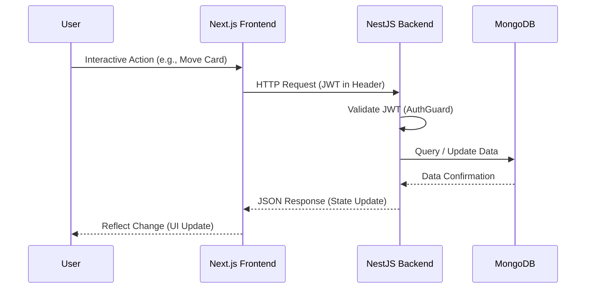
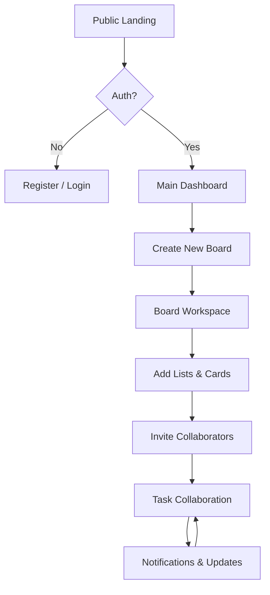

# System Architecture

## Visual Overview

### 🖥️ System Interaction Flow
This diagram illustrates the request-response lifecycle between the client, server, and database.



### 🛣️ User Journey Flow
The standard progression of a user through the Verve application.



## Overview
Verve is a full-stack Kanban application designed with a decoupled architecture. It provides a real-time-like experience for task management, leveraging modern web technologies to ensure responsiveness and scalability.

## Technology Stack

### Frontend
- **Framework**: [Next.js 15](https://nextjs.org/) (App Router)
- **State Management**: React Hooks & Server Actions
- **Styling**: [Tailwind CSS](https://tailwindcss.com/)
- **UI Components**: Custom components with [Lucide React](https://lucide.dev/) icons.
- **Client-Side Validation**: [React Hook Form](https://react-hook-form.com/)

### Backend
- **Framework**: [NestJS 11](https://nestjs.com/)
- **API Style**: RESTful API
- **Authentication**: JWT-based authentication using [Passport.js](https://www.passportjs.org/)
- **Email Service**: [Nodemailer](https://nodemailer.com/) via `@nestjs-modules/mailer`

### Database
- **Primary Database**: [MongoDB](https://www.mongodb.com/)
- **ORM/ODM**: [Mongoose](https://mongoosejs.com/)

## System Components

### 1. Client (Presentation Layer)
The frontend is responsible for rendering the user interface and managing local state. It communicates with the backend via HTTP requests.
- **Components**: Reusable UI elements (Buttons, Inputs, Modals).
- **Contexts**: Global state management for authentication and notifications.
- **Pages**: Modular routes for Login, Register, Dashboard, and Board workspaces.

### 2. Server (Application Layer)
The backend handles the business logic, authentication, and data persistence.
- **Modules**: Feature-based modularity (Auth, Boards, Cards, Notifications).
- **Controllers**: Entry points for HTTP requests.
- **Services**: Contain the core business logic.
- **Schemas**: Define the data structure for MongoDB.

## Data Flow

1.  **Request**: User interacts with the UI (e.g., moves a card).
2.  **Frontend**: Triggers an API call to the backend.
3.  **Authentication**: Requests are validated via JWT in the `AuthGuard`.
4.  **Backend Logic**: The `CardsService` updates the card's position in the database.
5.  **Response**: The backend returns the updated data.
6.  **UI Update**: The frontend reflects the change immediately.

---

## Directory Structure

```text
verve/
├── client/           # Next.js frontend
│   ├── app/          # App router routes
│   ├── components/   # UI components
│   └── lib/          # Utilities and API clients
├── server/           # NestJS backend
│   ├── src/          # Source code
│   │   ├── auth/     # Authentication logic
│   │   ├── boards/   # Kanban board logic
│   │   └── ...       # Other feature modules
└── docs/             # Technical documentation
```
